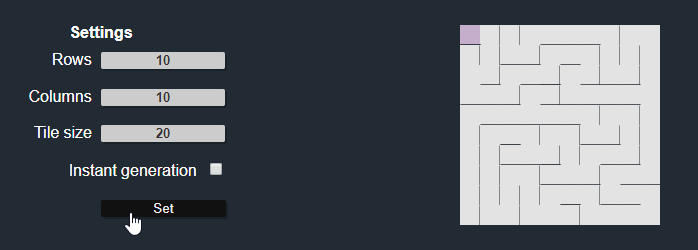

# Maze Generator

A Javascript maze generator using depth-first search with a recursive backtracker (it just means it uses a stack!). Detailed info on the algorithm [here](https://en.wikipedia.org/wiki/Maze_generation_algorithm).

  

Live [demo](https://dodicin.github.io/maze-generator)

#
## Structure
The main classes are kept under the `\src` folder.
To serve them in `\assets\bundle.js`, `browserify` has been used, so for editing remember to run `browserify \src\main.js -o assets\bundle.js`.

#
## Todos
* Adding maze resolution interactive game
* Adding other maze generation algorithms

#
## Author

* **Nassim Habbash** - [dodicin](https://github.com/dodicin)
